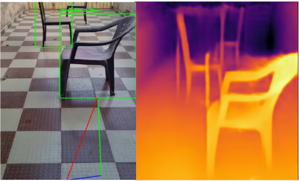
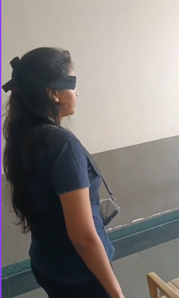
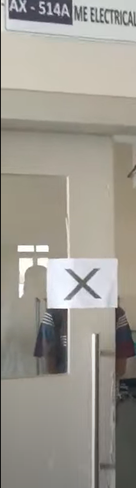

# 🧭 Face Recognition and Navigation Aid for the Visually Impaired

## 🧠 Overview

The visually impaired community faces significant challenges in navigation, object recognition, and social interactions, despite the availability of various assistive technologies. Existing solutions often fall short in providing a comprehensive, integrated approach to address these needs effectively.

This project proposes an advanced assistive system designed to enhance independence and safety for visually impaired individuals. By integrating **real-time navigation**, **object detection**, **person recognition**, and **distance measurement**, the system leverages technologies in **deep learning**, **computer vision**, and **LLM-based vision processing** via Together API.

---

## 🚀 Features

- 🔍 Real-Time **Object Detection** using YOLO and EasyOCR.
- 🧑‍🤝‍🧑 **Face Recognition** with DeepFace to identify known individuals.
- 📍 **Live Navigation Instructions** powered by Together API using LLaMA 3.2 Vision.
- 📏 **Distance Measurement** for obstacle avoidance via depth analysis.
- 🗣️ **Audio Feedback** using pyttsx3 (Text-to-Speech).

---

## 🧰 Tech Stack

- Python 3.7+
- Flask
- OpenCV
- DeepFace
- Ultralytics YOLO
- EasyOCR
- Together API (LLaMA 3.2 Vision)
- pyttsx3
- python-dotenv

---

## 📦 Installation

### 1. Clone this Repository

```bash
git clone https://github.com/yourusername/face-recognition-navigation-aid.git
cd face-recognition-navigation-aid
```
### 2.  Install Dependencies

```bash
pip install -r requirements.txt
```
### 3. Setup Environment Variables
Create a file named .env in the root directory and add your Together API key and Camera URLs

```bash
TOGETHER_API_KEY=
CAMERA_1_URL=
CAMERA_2_URL=
```
## 📚 Python Libraries Used

```txt
flask
opencv-python
numpy
scikit-learn
deepface
pyttsx3
ultralytics
together
easyocr
python-dotenv
```
## Usage

1. Clone the repository:
2. Navigate to the project directory.
3. Run the desired Python script from the command line.
   ``python Server.py``
4. Make sure that all systems are connected via same network and Camera URLs are updated in .env

This will:
Access webcam or IP camera input
Detect faces and objects in real time
Provide audio feedback using pyttsx3
Send frames to Together’s LLaMA 3.2 Vision API for intelligent guidance
Assist users with navigation and obstacle avoidance

## Sample Outputs





## Contributors

- Suhaani Aggarwal - suhaaniaggarwal07@gmail.com
- Tejashree Bhangale - tejashree.bhangale@gmail.com
- Austin Paul - austinpaulanthony@gmail.com
- Sameer Bharambe - sameerbharambe6@gmail.com

## 📄 License

This project is licensed under the MIT License. However, **certain components and the overall system design have been patented**. Unauthorized commercial use or replication of the patented aspects is strictly prohibited.

---
